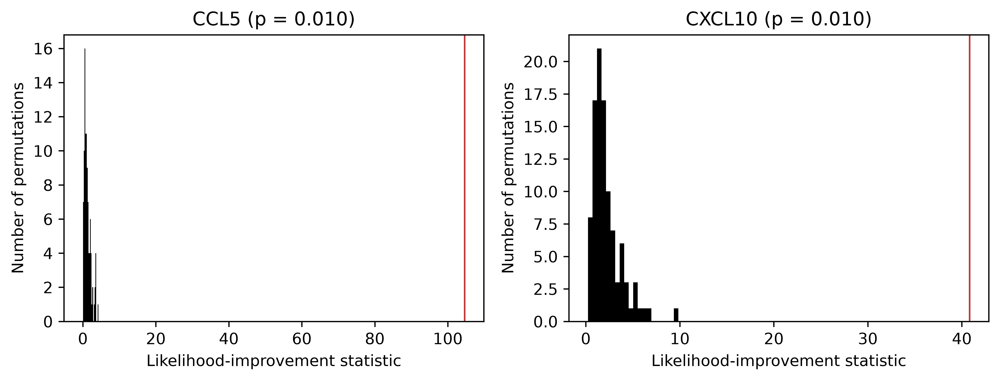

# pseudotimede-py


[PseudotimeDE](https://doi.org/10.1186/s13059-021-02341-y) is a statistical
method for testing whether genes are differentially expression across a
pseudotime trajectory. This repository gives a python implementation following
the existing [R package](https://github.com/SONGDONGYUAN1994/PseudotimeDE).
It uses the [scDesigner](https://github.com/krisrs1128/scDesigner) package to
accelerate model fitting.



You can see an example application in this
[notebook](https://github.com/krisrs1128/pseudotimede_py/blob/main/examples/lps.ipynb).
To install the package, you can use,

```
pip install pseudotimede-py
```

If you have questions, feel free to open an [issue](https://github.com/krisrs1128/pseudotimede_py/issues) or [contact us](https://measurement-and-microbes.org/_includes/contact).